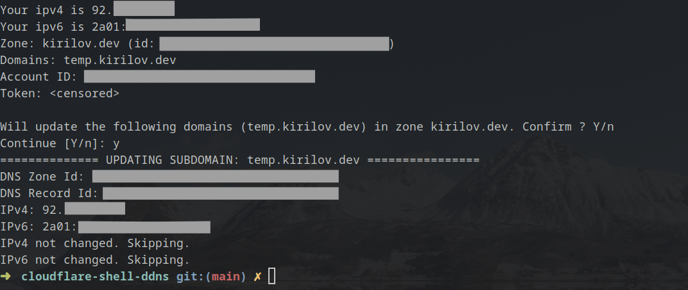

# Cloudflare DDNS Update POSIX Script

A POSIX shell script that updates cloudflare A and AAA records for a DNS Zone whenever your external IP changes.

Useful for home servers when you do not own a static IP address.



## Requirements

Although the scripts run on a POSIX shell it requires the following programs:

- jq
- curl

## Usage

```
./update_dns.sh --zone <zone-name> --domains <comma separated records to update> --account <cloudflare-account-id> --token <cloudflare-token>
```

Example:

```
./update_dns.sh --zone domain.com --domains domain.com,about.domain.com --account 0f000000000000000 --token 0f0000000000000000
```

The above command will update the A and AAA records for *domain.com* AND *about.domain.com* in the *domain.com* zone.


## Obtaining a Token

To generate an access token in Cloudflare you need to go to:

My Profile -> API Tokens -> Create Token -> Edit zone DNS (Template) 

## How it Works

* The script first obtains your current IPv4 and IPv6 using curl and *ifconfig.co*.

* It then stores the address in /tmp as a file if not yet present

* It compares the current IP address you have with the previously stored

* If the IPs are different it will proceed with updating the records in the zone

## Environment Variables

All program arguments can be provided as environment variables:

Example:

```
zone_name=<zone name> account=<account id> domains=<records to update> token=<access token> ./update_dns.sh
```

Note: You can use the --yes option to skip confirmation message.

## TODO

- [ ] Remove jq requirement: parse curl responses with sed